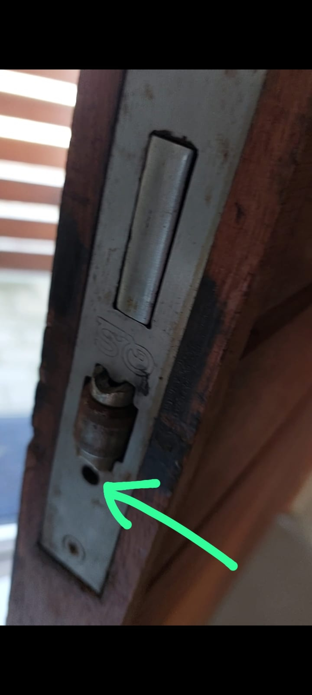

***

## House Information

* __Address:__

  ......[96 6th Avenue, Shelley Point Estate](https://goo.gl/maps/jKLYZdVhVG5Jo2Av8)

* __Front Door:__

  ......Turn key in the **opposite direction** (clock-wise) and give it a good push
  
  NOTE:: If front door is a bit hard to open, you can loosen / tighten it up easily.
  
  Behind the door there is a hanger, reach above and you will see an orange screwdriver.
  
  Place it in the opening seen below and turn it to loosen / tighten. 
  
  {width=20%}
  
  PLEASE return the screwdriver again thanks!

* __Wifi:__

  ......__Username__: Shelley966th
  
  ......__Password__: SHP96thwifi123

  ......Free uncapped fibre wifi with UPS.
  
  ......2.4 GHZ has stronger, but slightly slower signal
  
  ......Name ending in XXX_Ext is from the Wifi booster in the main bedroom - allowing access there and in the back room.

* __Front window shutters__

  ......opening and closing is a two-man operation.
  
  ......open from inside - unlatch and clip in outside

* __Smart TVs__:

  ......Please log in to your own Netflix / Youtube / Disney account.

  ......Feel free to use DVD player in the loft - great for entertaining kids.

* __Outside bedroom:__ 

  ......key is under stairs on the key holder.

* __Wood:__ 

  ......we will try supply a few pieces of wood (cannot guarantee) to get you started. Please buy more wood from [Spar](https://goo.gl/maps/ukLPuzQC6ErWaXut5s) or the OK supermarket and leave leftover wood for the next group - pay forward the wood-love...

* __Bathtowels:__ 

  ......unfortunately not for beach use **at all**.

* __Beach Sand__: 

  ......Please use tap outside house to wash off beach sand and not the showers or bathtub. Drains get clogged with sand easily.

* __Airfryer__

  ......simple to use and effective - plenty of Youtube ideas for cooking with it.

* __Gas oven__: see Oven tab above

* __Dishwasher:__

  ......Put on 35 degrees (far left option) OR quick shine (58 min 60 degrees)
Please only use dish washing pods. If you add sunlight or other soap, you can damage the machine and cause a big mess.

* __Washing machine:__

  ......use own washing liquid (available at SPAR) and pour it into left side (handle under "direct drive")
  
  ......press start button
  
  ......turn the button clock-wise till you see 28 on the digital screen.

  ......Press play.

  For an extra spin:
  
  ......wait till cycle mentioned above is finished, then:
  
  ......press start button
  
  ......press spin on touch screen (right) till you see 15 on the digital screen.
  
  ......press play

  ......Please use only clothes washing soap!

* __Garden Sprinkler:__

  ......Take note that the garden sprinkler system goes of on every even calender day at 3 am.
  
  
* __Alarm__:

  ......It is a 24 hour security estate and VERY safe, but for extra peace of mind use the alarm.
  
  ...... When checking out, please switch on the alarm (lock key) - hold in for 2 seconds until you hear a beep.
  
  ......the single dot switches on a stay alarm (outside beams and garage is on, you can roam in the house).
  
  ......double dot is for panic.
  

