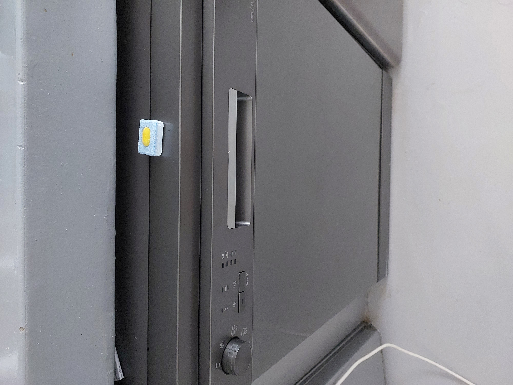
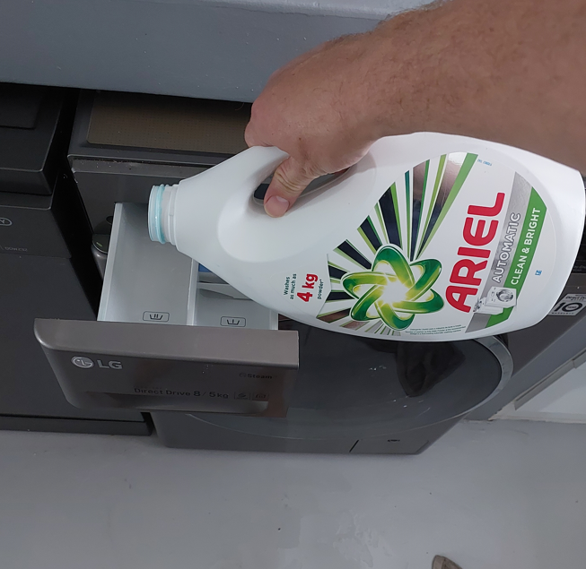
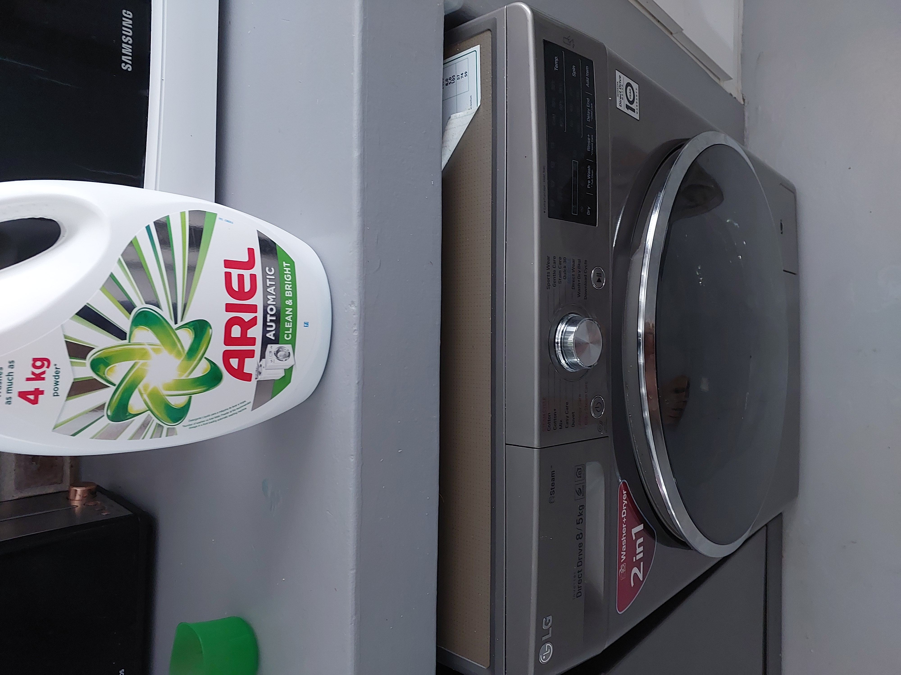

***

## Appliances

If you intend using either of the appliances, please only use soap that is appropriate for each:

### Dishwasher

{width=35%}

  ......Put on 35 degrees (far left option) OR quick shine (58 min 60 degrees)
Please only use dish washing pods. If you add sunlight or other soap, you can damage the machine and cause a big mess.

***

### Washing machine

{width=35%}

{width=35%}

### Using the washing machine

* __Washing machine:__

  ......use own washing liquid (available at SPAR) and pour it into left side (handle under "direct drive")
  
  ......press start button
  
  ......turn the button clock-wise till you see 28 on the digital screen.

  ......Press play.

  For an extra spin:
  
  ......wait till cycle mentioned above is finished, then:
  
  ......press start button
  
  ......press spin on touch screen (right) till you see 15 on the digital screen.
  
  ......press play

  ......Please use only clothes washing soap!

__NEVER force the door open - wait until it unlocks, or switch off washer completely until it unlocks. Please phone us if uncertain (0794919273)__

