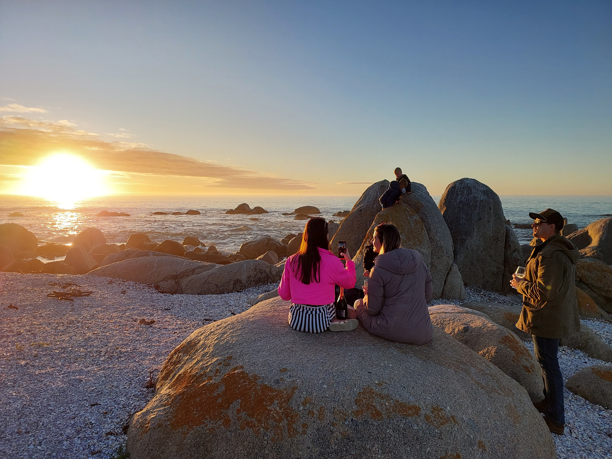

***

### Our favourite sundowner spot is at [Marina se bankie](https://goo.gl/maps/cpqhR3hfDWWHBvKF9):

{width=70%}

### Club House

* At the [Golden Mile security gate](https://goo.gl/maps/8kTsHdgG5Z81pvuw8) you'll find the SPHOA clubhouse.

There's a great deli as well as a playground for children. This is within the estate, so it is safe and secure - with great prices for food (we normally eat breakfast there as you can't make it for that cheap :) 

**Tag for swimming pool is on the key - you are welcome to enjoy it.**

### Beaches

* Be sure to try out [Golden mile beach](https://goo.gl/maps/GsC7KPvfA5DCc3s88), [Light House beach (great if it is a windy day)](https://goo.gl/maps/vzUAc24WbHjdLi7X8) and the [launch beach (great if it is a windy day)](https://goo.gl/maps/Qt3m2vcvth4TatUw7)

### Restaurants

* We highly recommend going to Alegria restaurant (as you enter St. Helena Bay), and also Gaatjie & Leeto (Paternoster).

### Experiences

* A MUST DO if you are new to the area is the gin tasting at [Poetic License distillery](https://poeticlicensedistillery.co.za/) in Velddrift ([map link](https://goo.gl/maps/9izKoBDZiA9p5dEF7)). 25min drive, totally worth it.

* Back road (along the nature reserve) to Paternoster is also great to do if you have an offroad capable car. Let us know if you need directions.

### Pubs

* For the thirsty, [Noordblinder](https://goo.gl/maps/nCvzuv2CW468daEs9) offers a nice easy going West-Coast pub vibe, and JP's Pub and Grill has a nice casual menu too.

* The harbour has great fresh seafood and calamari.

### Amenities

* You can enjoy a round of golf (first hole is ~200m from house), two tennis courts and lawn bowls (150m from the house) - for each you must please book at the golf club in the estate.

* Shelley Point Kayaking is also great - you often see dolfins, sunfish and if you are lucky a whale (Whatsapp: 082 805 5363)

